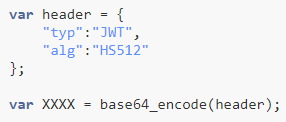
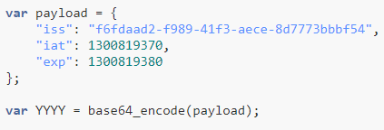
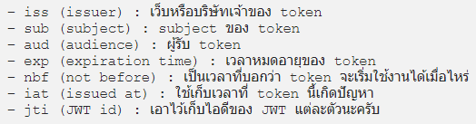
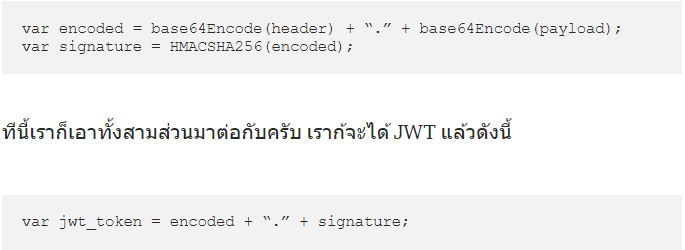
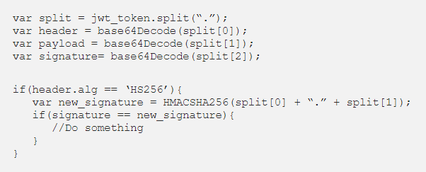

Http protocol จะรับส่ง data โดยส่ง request ไปที่ web server เมื่อ web server ได้รับ request จะตรวจสอบสิทธิ์ในการเข้าถึง resource โดย Http protocol จะเป็น stateless (ไม่จดจำสถานะการทำงาน) คือทุกครั้งที่ส่ง request ไปจะไม่มีการจัดเก็บข้อมูลใดๆไว้ที่ web server ทำให้ทุกครั้งที่ส่ง request ไปต้องตรวจสอบสิทธิ์ใหม่ทุกครั้ง แก้ไขปัญหาด้วยวิธีดังนี้

> `Note :` 
> - `stateful` => จดจำ state การทำงานไว้ที่ web server เช่น _`Application ที่ใช้ Session`_
> - `stateless` => ไม่จดจำ state การทำงานไว้ที่ web server เช่น _`Application ที่ไม่ใช้ Session แต่จะใช้อย่างอื่นแทน ที่เรียกว่า Token`_

`1. Session`
> เป็นวิธีการที่ web server จดจำสถานะการทำงาน/ระบุตัวตนของ client โดยเมื่อ client ต้องการเข้าถึง resource ของ web server จะสร้างรหัสชุดนึงขึ้นมา (Session Id) แล้วส่ง Session Id ไปพร้อมกับ request 
> - Client จะเก็บ session id เป็น cookies เมื่อมีการส่ง Http request ไปอีกครั้ง client จะต้องส่ง session id ไปด้วยเพื่อบอกกับ web server ว่าเคยได้รับสิทธิ์ในการเข้าถึง resource แล้วด้วย session id นี้ จะได้ไม่ต้องตรวจสอบสิทธิ์ใหม่ ทำให้มันกลายเป็น stateful
>> `Note :` cookies คือ ข้อมูลขนาดเล็กที่เก็บไว้ที่ web browser พวกข้อมูลการเข้าถึงเว็บไซต์ , ข้อมูลส่วนตัวที่เราใช้ลงทะเบี่ยนในเว็บไซต์

`2. JWT (Json Web Token)`
> เป็น standard token รูปแบบหนึ่ง คือการเอา json data ของ user มาทำ Token แล้วส่งไปกับ request ให้ web server เป็นการทำงานแบบ stateless ไม่มีการเก็บข้อมูลไว้ที่ web server จะตรวจสอบสิทธิ์ทุกครั้งที่ส่ง request ไปพร้อมกับ token
>
> รูปแบบของ token XXXX.YYYY.ZZZZ
> - XXXX = base64_encode(`header`)
> - YYYY = base64_encode(`payload`)
> - ZZZZ = base64_encode(`sign`(payload, header.algorithm, `SECRET_KEY`)) 
>
> จะแบ่งออกเป็น 3 ส่วน
> - `Header` => เป็น json data ที่ถูกเข้ารหัส และมีรูปแบบตามภาพ \
> 
>   - type => รูปแบบของ token
>   - alg => algorithm ที่ใช้ในการ encryption signature
>
> - `Payload` => เป็น json data ของ user + data เฉพาะที่เอาไว้ระบุพฤติกรรมของ token หรือเรียกอีกชื่อว่า  JWT Claim  แล้วเข้ารหัสไว้ ตามภาพ
> 
>
>> `Note :` JWT Claim แบ่งได้ 3 รูปแบบ
>>   - `Registered Claim` 
>>
>> 
>> 
>>   - `Public Claim` => เป็น data ของ user ที่เราสร้างขึ้นเองที่สามารถเปิดเผยได้ เช่น userId , username , e-mail , firstName , lastName เป็นต้น
>>
>>   - `Private Claim`=> เป็น private data  ที่ผู้สร้างและผู้ใช้งาน token ตกลงร่วมกันที่จะใช้
>> 
>> `หมายเหตุ :` ไม่ได้บังคับว่าจะต้องมี Claim ให้ครบทุกรูปแบบใน Payload
>
> - `Signature` => มันคือการเอา header และ payload มาเข้ารหัส(เข้ารหัสแยกกัน) แล้วเอาผลลัพธ์ของทั้ง 2 ส่วนมาต่อกันด้วยจุด( `.` ) แล้วทำการเข้ารหัส algorithm ด้วย secret key ก็จะได้เป็น Signature ออกมา
> 
> `Note: ` secret key เป็น string อะไรก็ได้ที่เราตั้งขึ้นมา และเราควรเก็บมันไว้ให้ดีอย่าให้คนอื่นรู้
>
> `Note :` JWT Token ส่วน header , payload เข้ารหัสด้วย base64
>
> ในการตรวจสอบ JWT Token ว่ามีการแก้ไขกลางทาง? , Token ถูกต้อง? ทำได้ ดังนี้
> - แยกส่วน Signature ออกมา (`ซึ่ง Signature ไม่สามารถแก้ไขและมีความ unique เพราะมันถูกเข้ารหัส algorithm ด้วย secret key ที่มีเพียงเราที่รู้`)
> - แล้วนำส่วนของ header , payload มาถอดรหัส แล้วทำการสร้าง Signature อีกครั้ง แล้วนำ Signature ตัวใหม่ที่ได้มาเปรียบเทียบกับ Signature ที่เราแยกออกมาก่อนหน้านี้ ถ้าตรงกันแสดงว่าข้อมูลถูกต้องไม่ถูกแก้ไข token มีความน่าเชื่อถือสามารถนำไปใช้ต่อได้ \
>` Note :` ก่อนจะถอดรหัส เราต้องรู้ก่อนว่าเราเข้ารหัสด้วย algorithm แบบไหน
> 
> 
> `Note :` cookies คือ ข้อมูลขนาดเล็กที่เก็บไว้ที่ web browser พวกข้อมูลการเข้าถึงเว็บไซต์ , ข้อมูลส่วนตัวที่เราใช้ลงทะเบี่ยนในเว็บไซต์

> `อ่านข้อมูลเพิ่มเติม : ` 
> - https://www.jittagornp.me/blog/what-is-jwt/
> - https://konoesite.com/%E0%B8%97%E0%B8%B3%E0%B8%84%E0%B8%A7%E0%B8%B2%E0%B8%A1%E0%B8%A3%E0%B8%B9%E0%B9%89%E0%B8%88%E0%B8%B1%E0%B8%81%E0%B8%81%E0%B8%B1%E0%B8%9A-jwt-b8fcf52aa008
> - https://github.com/jwt-dotnet/jwt (`Jwt ของ Dotnet`)
> - https://jasonwatmore.com/post/2019/10/11/aspnet-core-3-jwt-authentication-tutorial-with-example-api#app-settings-development-json (`How to Jwt Dotnet`)
> - https://medium.com/@jamesirichai/%E0%B8%84%E0%B8%A7%E0%B8%B2%E0%B8%A1%E0%B9%81%E0%B8%95%E0%B8%81%E0%B8%95%E0%B9%88%E0%B8%B2%E0%B8%87%E0%B8%A3%E0%B8%B0%E0%B8%AB%E0%B8%A7%E0%B9%88%E0%B8%B2%E0%B8%87-hashing-%E0%B9%81%E0%B8%A5%E0%B8%B0-encryption-b9c2291ac935 (`Encryption ต่างกับ Hash ยังไง?`)
> - https://docs.microsoft.com/en-us/dotnet/api/system.identitymodel.tokens.jwt.jwtsecuritytokenhandler?view=azure-dotnet (`JwtSecurityTokenHandler`)
> - https://docs.microsoft.com/en-us/dotnet/api/system.identitymodel.tokens.securitytokendescriptor?view=netframework-4.8&viewFallbackFrom=netcore-3.1 (`SecurityTokenDescriptor`)
> - https://docs.microsoft.com/en-us/dotnet/api/microsoft.identitymodel.tokens.tokenvalidationparameters?view=azure-dotnet (`TokenValidationParameters`)
> - https://jasonwatmore.com/post/2020/04/19/angular-9-jwt-authentication-example-tutorial (`Jwt Angular`)
> - https://jasonwatmore.com/post/2020/05/25/aspnet-core-3-api-jwt-authentication-with-refresh-tokens (`refresh token Dotnet`)
> - https://jasonwatmore.com/post/2020/05/22/angular-9-jwt-authentication-with-refresh-tokens (`refresh token angular`)