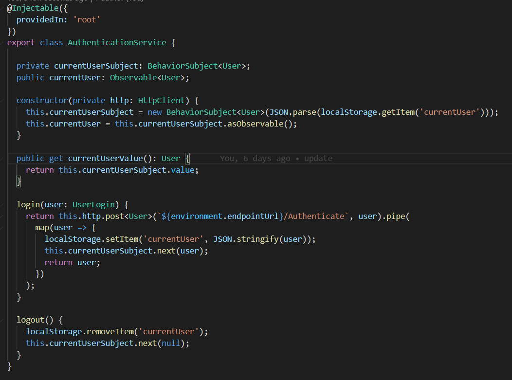
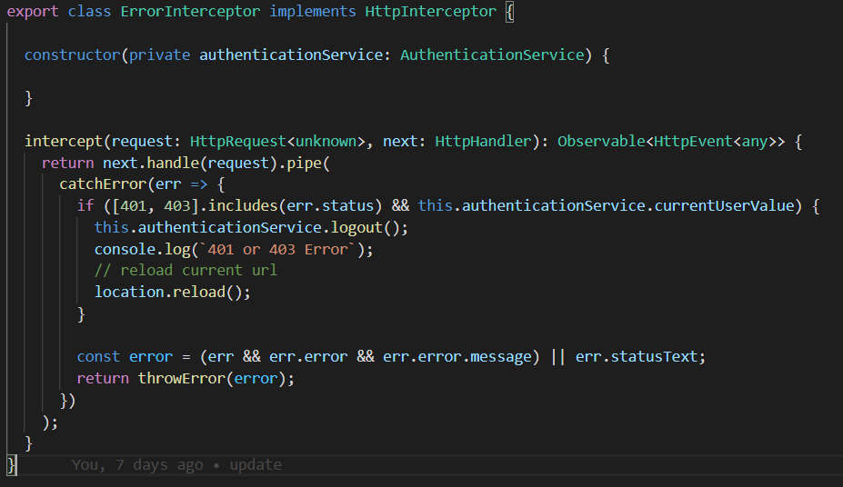
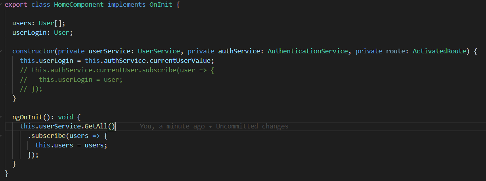
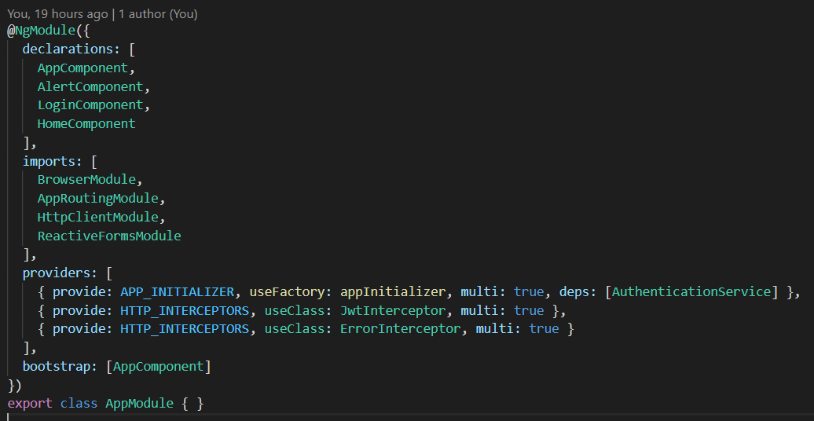

# Jwt Authentication Angular

> ## `Auth Guard`
> เป็น angular route guard ที่ป้องกันไม่ให้ Unauthenticated User เข้าถึง จากการจำกัด route ใช้ CanActivate interface และทำงานผ่าน method canActivate() จะ return boolean โดยใช้ authentication service ในการ check user ที่ login เข้ามา
> - `true` -> route activated อนุญาติให้เข้าถึง route เปิดหน้าต่อไป
> - `false` -> route จะถูก block ไม่ให้เข้าถึง กลับมาที่หน้า login
>
> 

> ## `Authentication Service`
> เป็น service ที่ใช้จัดการ Login & Logout และ allow access ให้ current user
> 
> มีการใช้ RxJs 
> - `Observable` -> เอาไว้เก็บ current user login ให้ component อื่นที่ต้องการ subscribe ไปใช้
> - `subject` -> BehaviorSubject มันจะเก็บค่าล่าสุดไว้ แล้ว emit ให้ทันทีเมื่อมีการ subscribe 
>
> มีการใช้ method
> - `constructor()` -> ทุกครั้งที่มีการ initialize service จะดึง data user จาก localStorage มาเก็บไว้ที่ subject  แล้วแปลงให้เป็น Observable เพื่อให้ component อื่นไป subscribe ต่อ
> - `login()` -> จะทำการ check authenticate user แล้วส่ง response data user กลับมาพร้อม Jwt แล้ว store ไว้ที่ localStorage แล้ว publish response data user ไปให้ subscriber ทุกตัว(`BehaviorSubject emit data user`)
> - `logout()` -> จะ remove data user ที่ localStorage แล้ว ส่งค่า null ไปเก็บที่ subject
>
> `Note : ` localStorage คือ Web Storage รูปแบบนึงที่เอาไว้เก็บ data ไว้ที่ฝั่ง client แบบเดียวกับ cookies แต่ไม่ต้องส่ง Http header ไปขอที่ server และเก็บ data ได้มากกว่า cookies 
> - เก็บ data ถาวร 
> - data จะหายก็ต่อเมื่อ clear Storage หรือ กำหนดเวลาหมดอายุ 
>
> วิธีใช้ Local Storage (`เก็บในรูปแบบ JSON string`)
> - localStorage.setItem(key, value) =>  การเก็บ data ลงใน Local Storage โดยมี key , value ซึ่ง key เอาไว้ ref value
> - localStorage.getItem(key) => การเรียกใช้ data โดยใช้ key ref ถึง value 
> - localStorage.removeItem(key) => การลบ data โดยใช้ key ref
> - localStorage.clear() => clear data ทั้งหมดใน locatStorage
>
> 

> ## `Http Error Interceptor`
> เอาไว้จัดการ response error ที่ได้จาก api
> - ถ้า 401 Unauthorize มันจะ logout auto
> - ถ้าเป็น error อื่นๆ ที่เกิดจาก call service จะ throw error ด้วย error message หรือ error status
>
> 

> ## `Jwt Interceptor`
> เอาไว้จัดการกับ request เมื่อ user login เข้ามา จะได้ data user ที่มี jwt token ติดมาด้วย จะเช็ค
> - เช็คว่ามี user data และมี token มั้ย?
> - เช็คว่า endpointUrl ของ api ใช่ api ของเราหรือเปล่า? 
>
> ถ้าผ่านเงื่อนไขข้างต้น จะนำ token ที่ได้มาเพิ่มใส่ Authorization header ของ request ที่จะส่งจาก Angular App 
>
> 

>## `User Model`
> เป็น class model ของ user
>
> 

> ## `User Service`
> เป็น service ที่ใช้จัดการกับ api ทั้งหมดที่เกี่ยวกับ User
>
> 

> ## `Home Component`
> เป็นหน้าแรกหลังจาก Login เข้ามา จะมีการ get data user ทั้งหมดมาโชว์ + ดึง data User จาก Observable subscribe มาใช้ ทำได้ 2 วิธี
> - ใช้ Observable subscribe มา (`currentUser`)
> - ใช้ BehaviorSubject get data ล่าสุดที่แชร์ไว้บน Observable ได้เลย (`currentUserValue`)
>
> `Note :` currentUserValue มาจาก currentUserSubject.value (`BehaviorSubject.value`)
>
> 
>
> 

> ## `Login Component`
> เป็นหน้าที่ใช้ login ผ่าน Reactive Form มี 2 วิธีในการส่ง data ขึ้นไปกับ api
> - แปลง form ให้เป็น model userLogin (authenticate request) แล้วส่งขึ้นไป
> - ส่ง form.value ขึ้นไปเลย
> 
>
> 

> ## `App Routing Module`
> กำหนด route ให้ Angular App 
>
> `Note :` สามารถกำหนดสิทธิ์การเข้าถึงแต่ละ route ด้วย property canActivate ที่ต้องเข้าผ่าน AuthGuard เพื่อให้ Guard เช็คก่อนเข้าถึง route
>
> 

> ## `App Component`
> เป็น root component ที่จะแปะ nav bar ไว้กดไป home , logout ออก
>
> `Note :` เอา currentUser(Observable) มาเช็คว่ามี User มั้ย เพื่อซ่อนแสดง Nav bar 
> - ถ้ามี User จะโชว์ Nav bar ใน home component
> - ถ้าไม่มี User จะซ่อน Nav bar ใน login component
>
> 
>
> 

> ## `App Module`
> เอาไว้ define module , component , Interceptor
>
> 

> ## `Environment Config`
> เป็นการ config ค่าต่างๆ เช่น endpoint url api เพื่อให้เวลา lauch มันจะ lauch ตาม config environment
>
> 
>   environment ของ product (`environment.prod.ts`)
>
> 
>  environment ของ dev  (`environment.ts`)
>
> `Note :` มีผลตอน build --prod