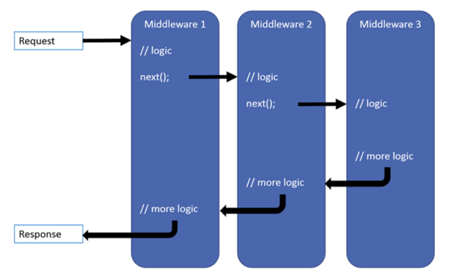
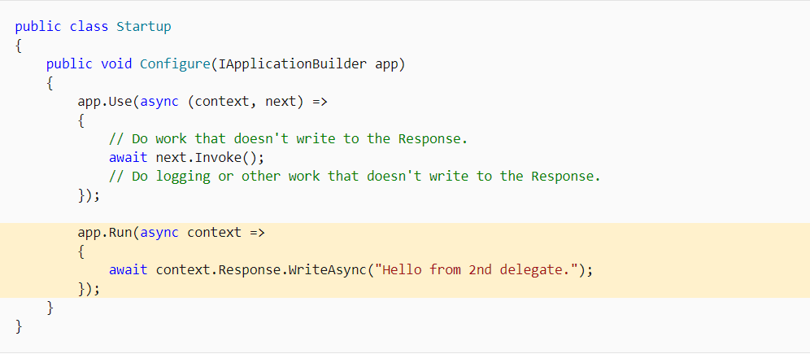
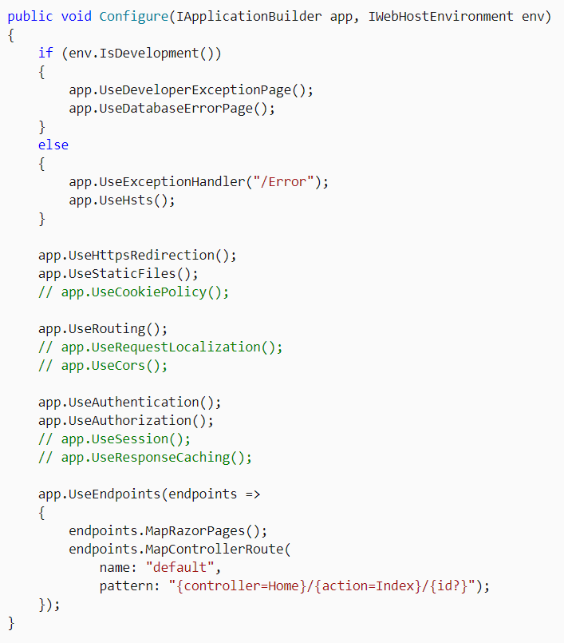
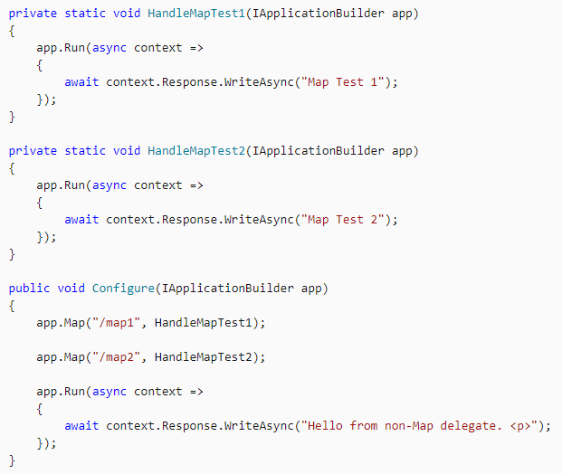
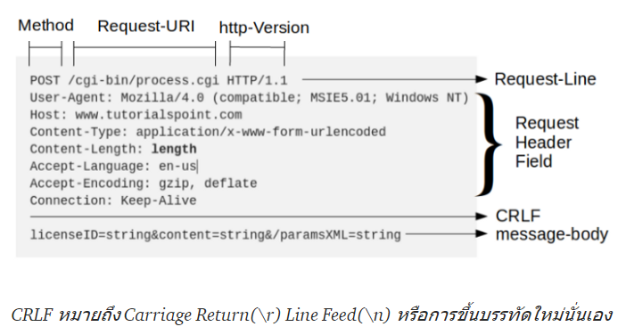
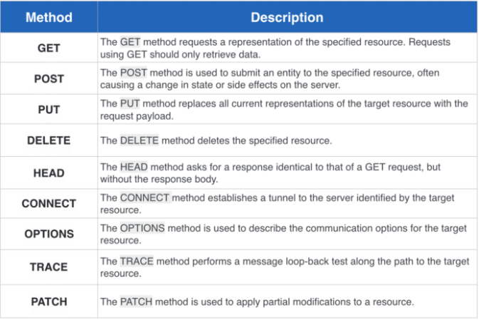
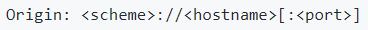
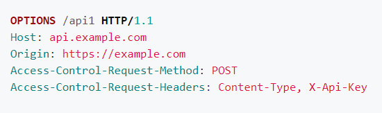
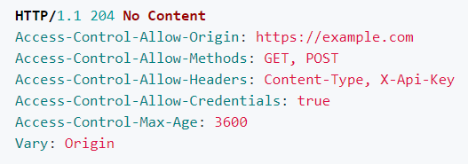

# Middleware
> เป็น pipeline ที่ใช้ handle request , response
>
> `Note : ` `Request delegates (Middleware)` 
> - ใช้สร้าง request pipeline และใช้จัดการแต่ละ Http request ที่เข้ามา
> - ใช้งานผ่าน Method Run , Map , Use
> - สามารถใช้แบบ anonymous(`anonymous middleware`) หรือ ใช้แบบ reusable class(`name middleware`) ทั้งหมดนี้เรียกว่า `"Middleware Component"`
> - แต่ละ Middleware Component ใน request pipeline จะถูกเรียกใช้ต่อกันไปเรื่อยๆ
>
> 
>
> - แต่ละ middleware สามารถจัดการ operation ก่อนหรือหลัง next middleware ได้
> - handle exception  ใน middleware ควรจะถูก call ก่อนใน pipeline และมันสามารถ catch exception ที่เกิดขึ้นในตอนสุดท้ายของ stage ของ pipeline
> - delegate short-circuits (`terminal middleware`) คือ middleware ที่ไม่ได้ส่ง request ไปต่อให้ middleware อื่นๆ
> - `Use` delegate ใช้เชื่อม request delegate หลายๆตัวเข้าด้วยกัน โดยที่ next parameter ก็คือ next delegate ที่จะถูก invoke ต่อใน pipeline
> - delegate short-circuits จะไม่มี next parameter เพราะว่ามันจะไม่ส่ง request ต่อไปให้ delegate อื่น
> - อย่า call `next.invoke()` หลังจากที่ response ถูกส่งไปที่ client แล้ว \
> `Note : `
> - `Run` delegate เป็น short-circuits จึงไม่มีการรับ next parameter จะถูกเอาไว้สุดท้ายเสมอ และทุกครั้งที่ execute เสร็จมันจะ terminate pipeline \
> `Note : ` ไม่ว่าจะเอา `Use` or `Run` delegate ไปไว้ข้างหลัง `Run` delegate มันจะไม่ถูก call เพราะว่า `Run` delegate มันจะ terminate pipeline ทิ้งเสมอ
>
> 
>
> - Middleware จะถูกใช้ใน Startup.Configure \
> `1. Exception/error handling` => 
>      - ถ้า app runs ใน Development environment
>        - `UseDeveloperExceptionPage()` => reports app runtime errors
>        - `UseDatabaseErrorPage()` => reports database runtime errors
>      - ถ้า app runs ใน Production environment
>        - `UseExceptionHandler()` => catch และ throw exception
>        - `UseHsts()` => จัดการเกี่ยวกับ Strict-Transport-Security
>  
>
> `2. HTTPS Redirection Middleware`
> - `UseHttpsRedirection()`=> redirect HTTP requests ไปที่ HTTPS
>
> `3. Static File Middleware`
> - `UseStaticFiles()`=> return static file และ short-circuits process request ตัวต่อไป
>
> `4. Cookie Policy Middleware`
> - `UseCookiePolicy()` => จัดการเกี่ยวกับข้อบังคับ General Data Protection Regulation (GDPR)
> 
> `5. Routing Middleware`
> - `UseRouting()` => ใช้สำหรับ route request
>
> `6. Authentication Middleware`
> - `UseAuthentication()` => ใช้สำหรับตรวจสอบ authentication ของ request ก่อนจะ allow ให้เข้าถึง resource
>
> `7. Authorization Middleware`
> - `UseAuthorization()` => ใช้ authorize ให้ request ที่ผ่านการ authentication ให้เข้าถึง resource
>
> `8. Session Middleware` 
> - `UseSession()` => สร้างและmaintain session state, ถ้า app มีการใช้ session state จะมีการ call` UseSession()` หลัง `UseCookiePolicy()` และก่อน `MVC Middleware`
>
> `9. Endpoint Routing Middleware`
> - `UseEndpoints()` => จัดการกับ request ที่เป็น endpoint
>
>`Note :` แต่ละ middleware ทำงานบน `IApplicationBuilder` ผ่าน library `Microsoft.AspNetCore.Builder` 
>
> `Note :` `UseExceptionHandler()` เป็น middleware ตัวแรกของ request pipeline ดังนั้นมันจะ catch ทุกๆ exception ที่เกิดที่ call ทีหลัง
>
> ## Branch the middleware pipeline
> เป็นการใช้ `Map` delegate ในการ map request path ที่เข้ามา ใช้เมื่อเราต้องการจัดการกับ request path ที่เฉพาะเจาะจง
>
> 
> 
> `Note :` อ่านรายละเอียดเพิ่มเติมได้ใน https://docs.microsoft.com/en-us/aspnet/core/fundamentals/middleware/?view=aspnetcore-3.1#branch-the-middleware-pipeline

# Knowledge Must Know
> ## HTTP
> - `HTTP` => เป็น protocol ที่ใช้ในการส่ง data ระหว่าง client กับ server 
> - `HTTP request` => เป็น request ที่ client ส่งไปที่ server
> - `HTTP response` => data ที่ server ส่งกลับมาให้ client เมื่อได้รับ request
>
> ### `HTTP request message`
> คือรูปแบบ message ของ client ที่จะบอกข้อมูลรายละเอียดให้กับฝั่ง server รับทราบ ประกอบด้วย 3 ส่วน
>
> - `Request-Line` => คือส่วนที่บอก HTTP Method , URI , version HTTP protocol
> - `Headers` => คือส่วนที่บอกข้อมูลและกฎต่างๆในการเชื่อมต่อ เช่น
>   - accept => รูปแบบของข้อมูล เช่น application/json, text/html
>   - accept-encoding => การเข้ารหัส เช่น gzip
>   - user-agen => ระบุประเภทของ Client เช่น Mozilla/5.0 
>   - ดูรายละเอียดเพิ่มเติมได้ที่ https://www.tutorialspoint.com/http/http_requests.htm
> - `Body` => คือส่วนที่บอกข้อมูลที่เราต้องการจะส่งให้ Server ​เช่น​ ​Client ส่ง request ข้อมูล​บางอย่าง​จาก​ Server​ เรา​ก็​สามารถ​ส่ง Parameter ต่าง​ๆ​ ​ไปใน​ Body หรือกรณี Client ส่ง request หน้าเว็บไซต์จาก Server​ จากนั้น Server ก็จะส่ง​ตัว​หน้าเว็บ​ไซต์กลับ​ไป​ โดยตัวหน้า​เว็บไซต์​ก็​จะ​อยู่​ใน​ Body นั้นเอง
>
> ### `HTTP request Method`
> คือส่วนที่ใช้ระบุประเภทของ request 
> 
> มีอยู่ 4 ตัวที่ใช้บ่อย
> - `GET` => ใช้สำหรับ request ที่เป็นการร้องขอ data
> - `POST` => ใช้สำหรับ request ที่เป็นการ create หรือ เพิ่มค่าใหม่
> - `PUT` => ใช้สำหรับ request ที่เป็นการ update ค่า โดยเราจะส่งมากับ payload
> - `DELETE` => ใช้สำหรับ request ที่เป็นการลบ
>
> ### `HTTP Response`
> ดูรายละเอียดที่นี่ https://medium.com/icreativesystems/basic-http-3a2b05e5aa19

>## REST & RESTFUL API
> `REST (Representational State Transfer)` -> เป็นรูปแบบของ software architecture ที่ใช้ web protocol(HTTP) ในการสร้าง web service
>
>`RESTFUL API (RESTFUL)` -> Web Service ที่ใช้ REST ในการสร้าง(ใช้ HTTP GET,POST,PUT,DELETE ในการ request และ response กลับมาในรูปแบบของ JSON หรือ XML ระหว่าง client กับ server)

> ## Cross-Origin Resource Sharing (CORS)
>
> `Note : ` `Origin` คือ HTTP request Header ที่เอาไว้บอกว่า request ถูกเรียกจากที่ไหน แบ่งออกเป็น 3 ส่วน
> - `Scheme` เช่น http, https
> - `HostName` เช่น example.com, www.example.com
> - `Port` เช่น 3000, 8000, 8080, 9000 
>  \
> `Ex.` http://example.com:8080 , https://example.com
>
> `CORS` คือ เมื่อเรามีการ fetch resource จาก Origin นึงไปอีก Origin , Web Browser จะส่ง option request ไปถาม server ของอีก Origin ว่าอนุญาติให้ Origin ต้นทางเข้าถึง resource ได้มั้ย? (`เป็นการอนุญาติสิทธิ์ให้เข้าถึง resource ข้าม Origin`)
>
> ตัวอย่างเช่น
>
> ถ้า https://example.com ต้องการเข้าถึง resource เช่น api , data ของ https://api.example.com 
> 
> - สิ่งที่เกิดขึ้น Web Browser จะส่ง preflight request ไปถาม https://api.example.com ก่อนว่า
>   - จะให้ Origin https://example.com ส่ง request ไปไหม ?
>   - จะให้ส่ง Method POST ไปไหม ?
>   - จะให้ส่ง Cookie (credentials: 'include') ไปไหม ?
>   - จะให้ส่ง Header Content-Type กับ X-Api-Key ไปไหม ?
>  
> > `Note :` cookies คือ ข้อมูลขนาดเล็กที่เก็บไว้ที่ web browser พวกข้อมูลการเข้าถึงเว็บไซต์ , ข้อมูลส่วนตัวที่เราใช้ลงทะเบี่ยนในเว็บไซต์
>
> - ถ้า Server ของ https://api.example.com จะตอบกลับ Web Browser เมื่ออนุญาติให้ Origin https://example.com เข้าถึง resource
>     - ให้ Origin https://example.com ส่ง request เข้ามาได้
>     - ให้ส่ง Method GET กับ POST เข้ามาได้
>     - ให้ JavaScript ส่ง Header Content-Type กับ X-Api-Key เข้ามาได้
>     - ให้ส่ง Cookie เข้ามาได้
>     - ให้ Browser จำคำตอบข้างบนไว้ 3600 วินาที จะได้ไม่ต้องมาถามซ้ำ
>  
>
> `Note : ` ใช้ Access-Control-Allow-Origin ในการอนุญาติสิทธิ์ให้ Origin อื่นเข้าถึง resource (`* => อนุญาติให้ทุก Origin`)

> ## HTTPS(Hypertext Transfer Protocol Secure)
> `Note : ` โดยปกติการส่ง data ผ่าน HTTP protocol จะอยู่ในรูปแบบ plain text ซึ่งมีข้อเสียเรื่องความปลอดภัยสามารถถูกดักจับได้ง่าย
>
> คือ protocol ที่เข้ารหัส data ที่รับส่งระหว่างเว็บไซต์กับผู้ใช้เพื่อให้เกิดความปลอดภัยในการับส่ง data บน Internet มากยิ่งขึ้น ไม่ถูกดักจับได้ง่าย
>
> `Note : ` SSL (Secure Socket Layer) คือ เทคโนโลยีในการเข้ารหัส data เพื่อให้เว็บไซต์หรือแอปพลิเคชั่นสามารถรับส่ง data ได้อย่างปลอดภัย มีความน่าเชื่อถือ
> - ปลอดภัย มีความน่าเชื่อถือ
> - ตรวจสอบความถูกต้องของ data ที่รับส่งได้
> - data จะไม่ถูกแก้ไขหรือเปลี่ยนแปลงระหว่างทาง

> ## CSRF กับ XSS 
> `1. CSRF หรือ XSRF (Cross-Site Request Forgery)`
> 
> คือ การปลอมแปลง request ที่จะส่งจากที่นึงไปอีกที่นึงโดยที่ User ไม่ได้รู้ตัวหรือยินยอม
>
> วิธีป้องกันคือ
> - สร้าง CSRF Token แนบไปกับ cookies (อยู่ใน header) แล้วก็ form ที่ใช้ส่ง data
> - Server จะตรวจสอบว่า CSRF Token ที่ส่งมาจาก form และ header ตรงกันมั้ย? ถ้าตรงก็ user valid session ถ้าไม่ตรงก็ user invalid session \
> `Note :` ถ้ามีการปลอมแปลง request ที่ยิงมาจากที่อื่น ตัว CSRF Token ที่อยู่ใน form จะไม่มีทางเหมือน CSRF ที่แนบอยู่กับ cookies ของเรา
>
> `2. XSS (Cross-Site Scripting)`
>
> คือ การโจมตีช่องโหว่ของ web โดยการฝัง code script ที่ไม่ปลอดภัย ลงไปบน Html เมื่อ user คนอื่นเปิด web script ที่ไม่ปลอดภัยก็จะทำงาน