# Asp.Net Core Jwt Authentication Structure

> ## Controller
> ใช้กำหนด endpoint,route สำหรับ Web Api เป็น entry point ของ Web Api ที่ client สามารถเข้าถึงผ่าน request
>
> `Note :` endpoint คือ ulr ที่จะใช้ call api

> ## Entity
>  คือ model ของ database ที่ใช้ส่ง data ระหว่าง service กับ controller
>
> `Note :` [JsonIgnore] คือ attribute ที่ป้องกัน property จากการ serialize และป้องกันไม่ให้ return ไปกับ response
>
> 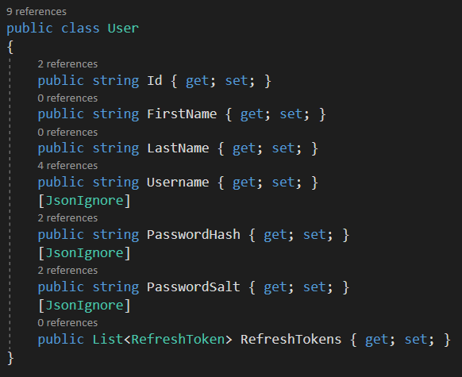

> ## AppSettings
> คือ class model ที่เอาไว้ map กับ property ที่ถูก define ไว้ใน `appsettings.json`
>
> 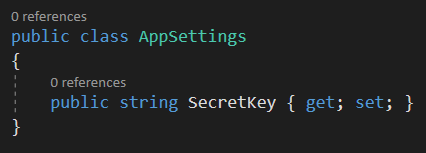
> 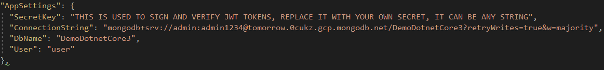

> ## Custom Authorize Attribute
> คือการ custom Authorize Attribute ที่ใช้ในการจำกัดสิทธิ์ในการเข้าถึงแต่ละ endpoint
>
> 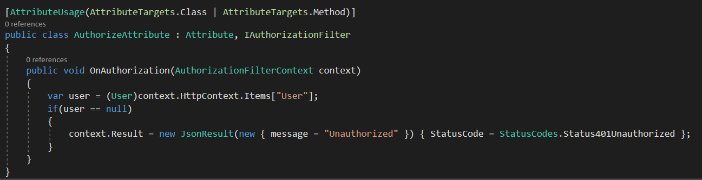
>
> จะทำงานผ่าน OnAuthorization โดยมันจะ check ว่ามี authenticated user ถูกส่งมากับ current request มั้ย (`context.HttpContext.Items["User"]`) ถ้ามีก็จะไม่ทำอะไรแล้วส่ง request ต่อไปที่ controller แต่ถ้าไม่มี มันจะ return response 401 Unauthorized กลับไป
>
> `Note : ` ถ้ามี authenticated user ถูกส่งมากับ current request มันก็จะถูกส่งผ่าน Jwt Middleware (`ถ้า request มี valid JWT access token`)

> ## JWT Middleware
> `Note : ` Middleware คือ request pipeline ที่เอาไว้ใช้ประโยชน์ดังนี้
> - เชื่อมต่อ application กับ network
> - จัดการ request/response
> - จัดการ/กรอง request ที่เราต้องการ
> - สามารถจัดการให้ระบบเสถียรและสามารถรองรับข้อมูลได้ตลอดเวลา
>
> JWT Middleware จะจัดการกับ token ดังนี้
> - validate token
> - แตก userId ออกจาก Token 
> - แนบ authenticated user เข้ามาใน current _`HttpContext.Items`_
>
> ถ้าไม่มี token หรือ ขั้นตอนด้านบน fail แล้วไม่มี user แนบมากับ http context จะ return response 401 Unauthorized กลับไป

> ## Authenticate Request Model
> เป็น model สำหรับ request ที่ใช้คุยกับฝั่ง client 
>
> 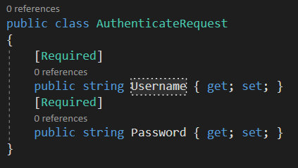
>
> `Note :` [`Required`] attribute เอาไว้ทำ validate ถ้าไม่มีข้อมูลส่งมากับ request body มันจะแจ้ง error ตอนที่ call api 

> ## Authenticate Response Model
> เป็น model สำหรับ response ที่ใช้คุยกับฝั่ง client ซึ่งจะประกอบไปด้วยข้อมูลของ user ยกเว้น password กับ token 
>
> 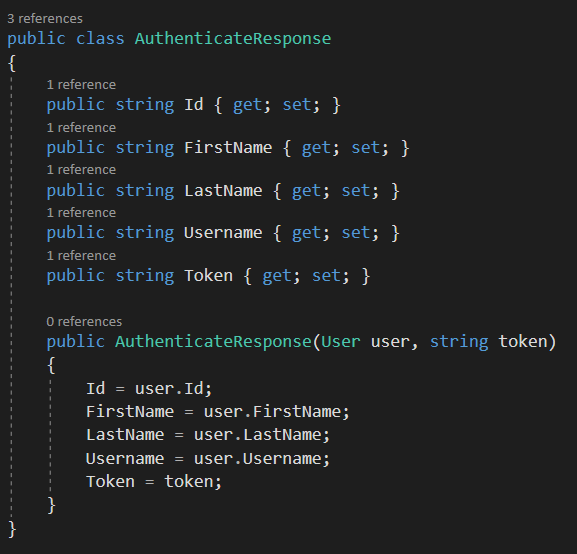

> ## UserService
> จะเอาไว้จัดการ authenticate user , return token , get all user , get use by id
>
> `Note :` `JwtSecurityTokenHandler` เอาไว้ create , validate JWT Token
>
> `Note :` `SecurityTokenDescriptor` จะมี attribute ที่เกี่ยวกับ jwt claim
>
> `Note :` ใช้ nuget `System.IdentityModel.Tokens.Jwt` , `Microsoft.IdentityModel.Tokens`
>
> 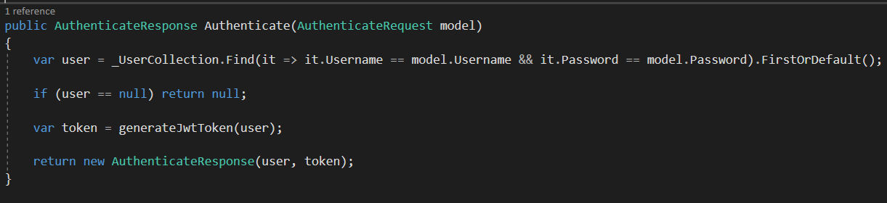
>
> 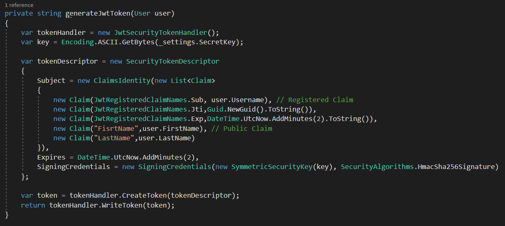

> ## JWT appsettings.json
> เอาไว้ config ค่าต่างเช่น secretKey, connectionString, DbName ,ชื่อ collection บน Database
>
> 

> ## Jwt Program.cs
> เป็น entry point เมื่อเริ่ม run app เอาไว้ config host url 
>
> 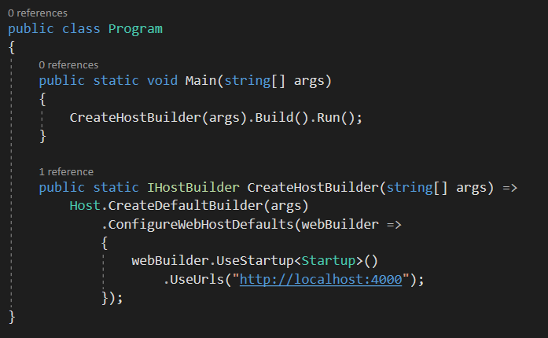

> ## Startup.cs
> เอาไว้ config เกี่ยวกับ dependency injection ของพวก service , appsettings , add CORS จัดการใน `ConfigureServices()` แล้วก็จัดการเกี่ยวกับ middleware request pipeline ใน `Configure()`
>
> 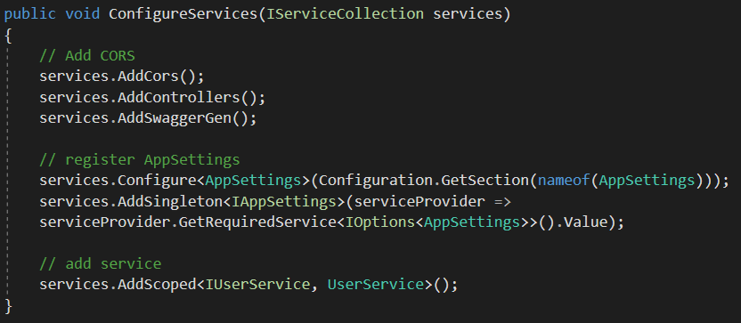
>
> 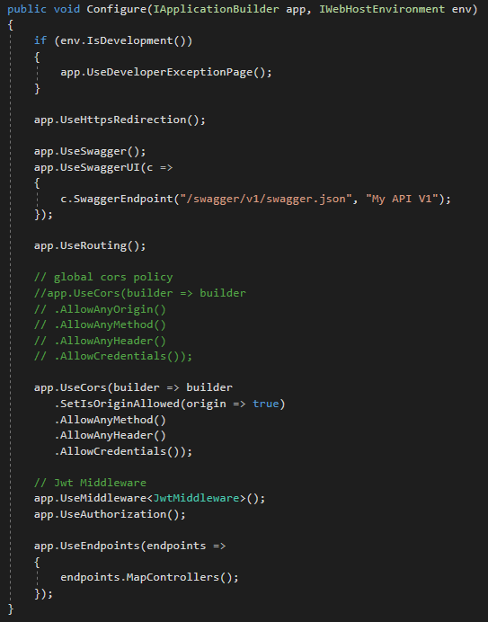
>
> `Note : ` ใน configure เราจะจัดการเกี่ยวกับ global CORS policy , จัดการ request เพื่อตรวจสอบ authenticate user ผ่าน JwtMiddleware 