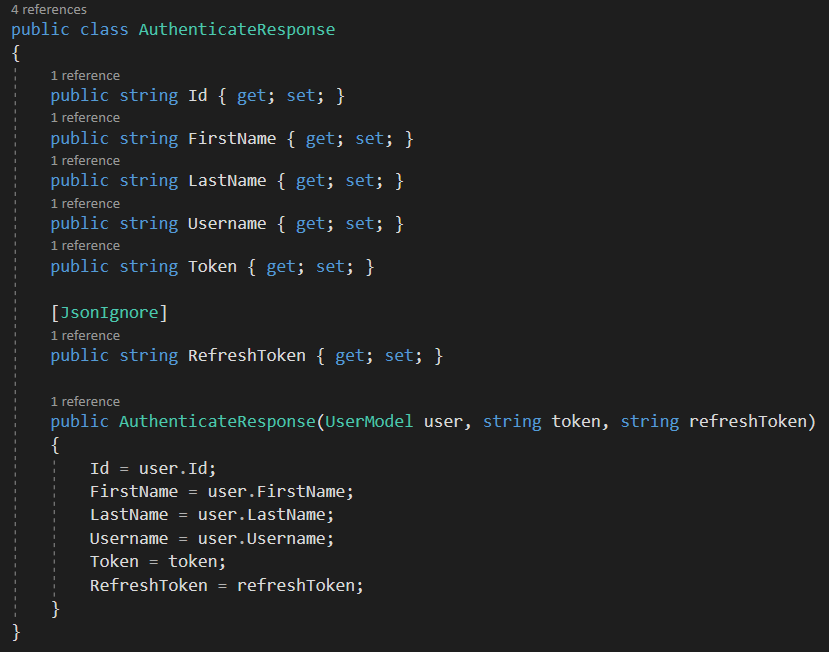
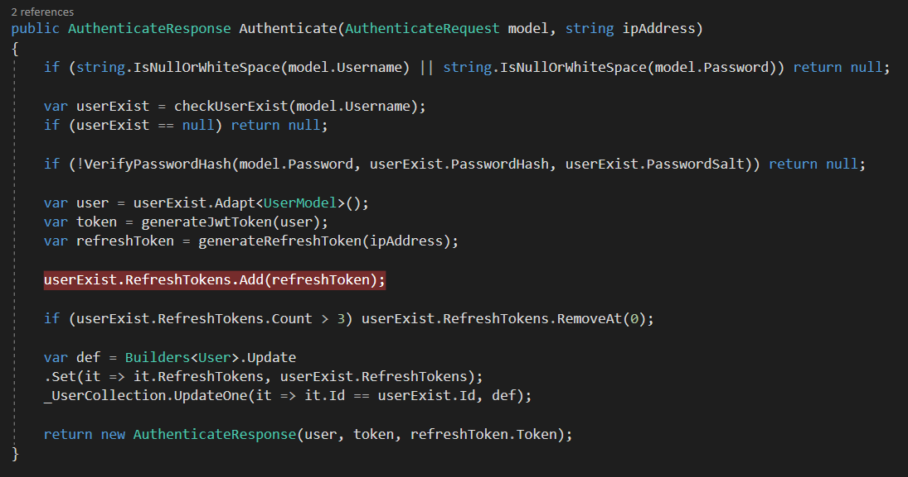

# Asp.Net Core Jwt Authentication Structure

> ## Controller
> ใช้กำหนด endpoint , route สำหรับ Web Api เป็น entry point ของ Web Api ที่ client สามารถเข้าถึงผ่าน request จะจัดการ
> - สร้าง User
> - get User ทั้งหมด โดยที่จะต้องได้รับการ authenticate ก่อนจึงจะ authorize ให้เข้า endpoint ตัวนี้ได้
> - authenticate user
>
> `Note :` endpoint คือ ulr ที่จะใช้ call api

> ## User Entity
>  คือ model ของ database ที่ใช้ส่ง data ระหว่าง service กับ controller
>
> `Note :` [JsonIgnore] คือ attribute ที่ป้องกัน property จากการ serialize และป้องกันไม่ให้ return ไปกับ response
>
> 

> ## RefreshToken Entity
> คือ model ของ refresh token ที่เราต้องเก็บลง Database
>
> 

> ## AppSettings
> คือ class model ที่เอาไว้ map กับ property ที่ถูก define ไว้ใน `appsettings.json`
>
> 
> 

> ## Custom Authorize Attribute
> คือการ custom Authorize Attribute ที่ใช้ในการจำกัดสิทธิ์ในการเข้าถึงแต่ละ endpoint
>
> 
>
> จะทำงานผ่าน OnAuthorization โดยมันจะ check ว่ามี authenticated user ถูกส่งมากับ current request มั้ย (`context.HttpContext.Items["User"]`) ถ้ามีก็จะไม่ทำอะไรแล้วส่ง request ต่อไปที่ controller แต่ถ้าไม่มี มันจะ return response 401 Unauthorized กลับไป
>
> `Note : ` ถ้ามี authenticated user ถูกส่งมากับ current request มันก็จะถูกส่งผ่าน Jwt Middleware (`ถ้า request มี valid JWT access token`)

> ## JWT Middleware
> `Note : ` Middleware คือ request pipeline ที่เอาไว้ใช้ประโยชน์ดังนี้
> - เชื่อมต่อ application กับ network
> - จัดการ request/response
> - จัดการ/กรอง request ที่เราต้องการ
> - สามารถจัดการให้ระบบเสถียรและสามารถรองรับข้อมูลได้ตลอดเวลา
>
> JWT Middleware จะจัดการกับ token ดังนี้
> - validate token
> - แตก userId ออกจาก Token 
> - แนบ authenticated user เข้ามาใน current _`HttpContext.Items`_
>
> ถ้าไม่มี token หรือ ขั้นตอนด้านบน fail แล้วไม่มี user แนบมากับ http context จะ return response 401 Unauthorized กลับไป
>
> 
>
> 
>
> `Note :` 
>   - `ValidateIssuerSigningKey` -> เป็นตัวที่บอกว่ามี SecurityKey ถูก sign ให้ SecurityToken มั้ย (`True`,`False`)
>   - `IssuerSigningKey` -> เป็น SecurityKey ที่ถูกใช้ในการเข้ารหัส alogorithm ให้ Signature \
> `Note :` SecurityKey ก็คือ Secret Key นั่นแหละ
>   - `ValidateIssuer` -> จะให้ validate Issuer ด้วยมั้ยในขณะที่ validate token \
>  `Note :` Issuer คือ เว็บ,บริษัทที่ออก token
>   - `ValidateAudience` -> จะให้ validate Audience ด้วยมั้ยในขณะที่ validate token \
> `Note :` Audience คือ ผู้รับ Token
>   - `ClockSkew` -> set เวลาหมดอายุให้ token หลังจากใช้ validate เสร็จ

> ## Authenticate Request Model
> เป็น model สำหรับ request ที่ใช้คุยกับฝั่ง client 
>
> 
>
> `Note :` [`Required`] attribute เอาไว้ทำ validate ถ้าไม่มีข้อมูลส่งมากับ request body มันจะแจ้ง error ตอนที่ call api 

> ## Authenticate Response Model
> เป็น model สำหรับ response ที่ใช้คุยกับฝั่ง client ซึ่งจะประกอบไปด้วยข้อมูลของ user ยกเว้น password กับ token 
>
> 

> ## Revoke Token Request Model
>

> ## UserService
> จะเอาไว้จัดการ authenticate user , return token , get all user , get use by id
>
> `Note :` `JwtSecurityTokenHandler` เอาไว้ create , validate JWT Token
>
> `Note :` `SecurityTokenDescriptor` จะมี attribute ที่เกี่ยวกับ jwt claim
>
> `Note :` ใช้ nuget `System.IdentityModel.Tokens.Jwt` , `Microsoft.IdentityModel.Tokens`
>
> - `Authenticate()` => เอาไว้ authenticate user ถ้าผ่านก็จะ generate jwt token,refresh token แล้วเก็บ refresh token ขึ้นไปบน Database เป็น list ของ refresh token แล้ว return response data user ที่มี jwt token , refresh token กลับไป
> 
>
> - `RefreshToken()`=> รับ active refresh token เข้ามาแล้ว return user data ที่มี Jwt Token กับ refresh token ตัวใหม่กลับไป refresh token ตัวเก่าจะถูก revoke ไม่สามารถเอามาใช้ได้อีก \
> `Note : ` การที่ใช้ refresh token ขอ jwt token ใหม่ พร้อม refresh token ใหม่ โดยที่ refresh token เก่าจะถูก revoke ไม่สามารถใช้ได้อีก เราเรียกการทำแบบนี้ว่า `refresh token rotation` การทำแบบนี้จะช่วยเพิ่ม security ให้ app เพราะ refresh token จะมีอายุการใช้งานที่สั้น เมื่อมีการ rotate ตัว refresh token ตัวใหม่จะถูกเก็บไว้ที่ฟีลด์ ReplacedByToken ของ revoke token
> - `RevokeToken()` => จะรับ active refresh token เข้ามาแล้ว revoke ให้มันไม่สามารถใช้งานได้อีก refresh token จะถูก revoke เมื่อมันมี revoke date และ ipAddress ของ user ที่ถูก revoke token จะเก็บไว้ที่ฟีลด์ RevokedByIp 
> - `generateJwtToken()` => ใช้ generate Jwt Token ที่จะหมดอายุ 15 นาที
> - `generateRefreshToken()` => ใช้ generate refresh token ที่จะหมดอายุ 7 วัน
> 

> ## JWT appsettings.json
> เอาไว้ config ค่าต่างเช่น secretKey, connectionString, DbName ,ชื่อ collection บน Database
>
> 

> ## Jwt Program.cs
> เป็น entry point เมื่อเริ่ม run app เอาไว้ config host url 
>
> 

> ## Startup.cs
> เอาไว้ config เกี่ยวกับ dependency injection ของพวก service , appsettings , add CORS จัดการใน `ConfigureServices()` แล้วก็จัดการเกี่ยวกับ middleware request pipeline ใน `Configure()`
>
> 
>
> 
>
> `Note : ` ใน configure เราจะจัดการเกี่ยวกับ global CORS policy , จัดการ request เพื่อตรวจสอบ authenticate user ผ่าน JwtMiddleware 

> ## Refresh Token
>